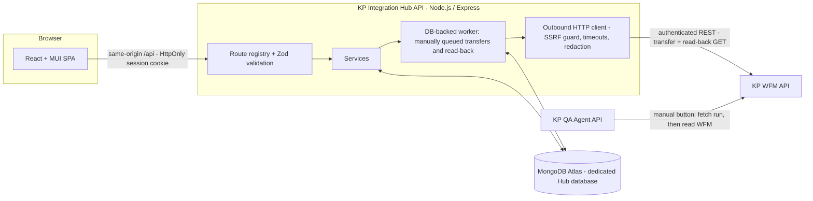

 KP Integration Hub

KP Integration Hub is an integration platform that moves and transforms records between **KP WFM** and other systems. Successful runs can be checked manually from the locally running **KP QA Agent**. It uses free and open-source application dependencies and does not use an AI service for integration checks.

> **Contract status — please read.** Configure WFM endpoints from the WFM API documentation. The local QA Agent fetches only successful Hub runs enabled for manual QA, then uses its own WFM profile and credentials to read and compare the destination record. See [`docs/LOCAL_QA_AGENT_FLOW.md`](docs/LOCAL_QA_AGENT_FLOW.md).

---

## Contents
1. [Architecture](#1-architecture)
2. [What is implemented](#2-what-is-implemented)
3. [Prerequisites](#3-prerequisites)
4. [Local development](#4-local-development)
5. [MongoDB Atlas free-tier setup](#5-mongodb-atlas-free-tier-setup)
6. [Environment variables](#6-environment-variables)
7. [Authentication and credential setup](#7-authentication-and-credential-setup)
8. [Connecting KP WFM](#8-connecting-kp-wfm)
9. [Connecting KP QA Agent](#9-connecting-kp-qa-agent)
10. [Execution model and statuses](#10-execution-model-and-statuses)
11. [API contracts](#11-api-contracts)
12. [Database, indexes, migrations and retention](#12-database-indexes-migrations-and-retention)
13. [Running tests](#13-running-tests)
14. [Smoke tests](#14-smoke-tests)
15. [Deployment (free tiers)](#15-deployment-free-tiers)
16. [Security recommendations](#16-security-recommendations)
17. [Backup and recovery](#17-backup-and-recovery)
18. [Updating and redeploying](#18-updating-and-redeploying)
19. [Troubleshooting](#19-troubleshooting)
20. [Known limitations](#20-known-limitations)

---

## 1. Architecture



There are three independent systems, each with its own persistence:

- **KP WFM** is the destination.
- **KP Integration Hub** stores its data in its own MongoDB database (default name `kp_integration_hub`).
- **KP QA Agent** performs verification.

The Hub talks to the other two **only** through their authenticated APIs. It never connects to their databases.

**Repository layout**

```
server/                 Express API (TypeScript)
  src/core/             Pure logic: transformation registry, validation, SSRF guard, HTTP client,
                        retry policy, redaction, crypto, execution engine, QA adapter, CSV parser
  src/services/         MongoDB-backed services (connections, integrations, runs, worker, audit, dashboard)
  src/routes/           Route definitions (single source for validation, auth and OpenAPI)
  src/http/             Registry, middleware (auth, CORS, rate limits, headers), OpenAPI generator
  src/db/mongo.ts       Collections, $jsonSchema validators, indexes (idempotent, non-destructive)
  scripts/              migrate.ts, export-openapi.ts
  test/                 Vitest + Supertest suites
web/                    React + Vite + MUI frontend
  tests/                Playwright browser smoke tests
scripts/smoke.mjs       Smoke tests against a running or deployed system (no mocks)
docs/                   Contract requirements; generated openapi.json
render.yaml             Optional Render blueprint (free web service + free static site)
```

## 2. What is implemented

| Module | Status |
|---|---|
| Authentication | Local e-mail/password accounts with scrypt hashing. Sessions are stored server-side and can be revoked. Browsers use an HttpOnly cookie; scripts use a bearer token. Roles are VIEWER, OPERATOR and ADMIN. |
| Connections | Create and edit connections. Credentials are encrypted with AES-256-GCM and never returned. A real health-check test is required before activation. Each connection records its documented operations and, for QA Agent, its contract. |
| Source data | Enter a JSON record, paste a JSON array, or upload a JSON or CSV file. Records are parsed and validated with a preview showing valid and invalid counts. Stored records are immutable snapshots with a SHA-256 hash. |
| Transformation engine | A safe registry: direct and renamed fields, nested paths, trim, case conversion, boolean-to-status, date formats, numbers, string/boolean conversion, defaults, allowed values, value lookup and null handling. There is no `eval` and no user code is ever executed. |
| Integrations | A 7-step wizard with a live preview. Integrations can be created, edited (each save is a new version), cloned, activated and deactivated. Version history, execution history and manual execution are all available. |
| Execution engine | Uses a database-backed queue with leases. Transfer status and QA status are tracked separately. Retries are bounded and safe for idempotency. Snapshots are immutable. Read-back verification is real, and executions recover after a restart. |
| KP WFM adapter | A configurable REST destination supporting POST, PUT, PATCH and DELETE, plus a read-back GET and real connection tests. |
| KP QA Agent adapter | The local QA Agent manually fetches an eligible Hub run, waits one minute, reads WFM, compares fields, and reports the result to the Hub. A shared API key protects this exchange. |
| Dashboard | Every metric is computed from stored data. A 14-day trend is shown, with an empty state when there is no data. |
| Execution history | Filters (date, integration, entity, transfer status, QA status, correlation ID) and pagination of at most 100 per page. The detail view shows snapshots, response, retries and differences. |
| Templates | Location inbound, Employee inbound and Generic REST. These are starting points only. |
| API documentation | The OpenAPI 3.1 document is generated from the implemented route registry and rendered in the UI. |
| Audit logs | Logins, configuration, credential, execution and QA events. Logs are redacted. |
| Entities | **Operational:** Locations, Employees and Generic. **Planned and visible but not selectable:** Departments, Jobs and roles, Schedules and shifts, Timecards, Time off, Forecasts, Budgets, Availability, Skills and certifications, Pay codes. |

**Not implemented (and not claimed):**
- SFTP polling, scheduled ingestion and event-based triggers.
- OAuth2, HMAC and mTLS authentication.
- Multi-instance distributed rate limiting.
- Real-time push to the UI. The UI polls instead.

## 3. Prerequisites

| Software | Version |
|---|---|
| Node.js | 20.11 or later (22 LTS recommended). Needed for `--env-file` and global `fetch`. |
| npm | 10 or later |
| MongoDB | Atlas free cluster (MongoDB 8.0), or a local MongoDB 7 or later for development and tests |
| Git | Any recent version |
| Browser | A current Chrome, Edge, Firefox or Safari |

## 4. Local development

```bash
git clone <your-repo-url> kp-integration-hub && cd kp-integration-hub
npm install                                  # installs server + web workspaces
cp server/.env.example server/.env           # fill in MONGODB_URI and the three secrets
node -e "console.log(require('crypto').randomBytes(32).toString('base64'))"   # run 3x for the secrets
npm run db:migrate                           # creates collections, validators and indexes (safe to re-run)
npm run dev:server                           # API on http://localhost:4000 (also starts the worker)
npm run dev:web                              # UI on http://localhost:5173 (proxies /api to :4000)
```

Sign in with `BOOTSTRAP_ADMIN_EMAIL` and `BOOTSTRAP_ADMIN_PASSWORD`. The admin is created only when the users collection is empty. Remove the password from `.env` afterwards.

If KP WFM or QA Agent run on `localhost` during development, set `ALLOW_PRIVATE_DESTINATIONS=true` in `server/.env` **for development only**.

To build for production: run `npm run build`, then `npm start --workspace server` (or `npm run start:local --workspace server` to load `.env`).

## 5. MongoDB Atlas free-tier setup

1. Sign in at <https://cloud.mongodb.com>. Create a project, then **Build a Database → Free**, and pick a region close to your backend host.
2. **Database Access:** create a user dedicated to the Hub with *Read and write* on the `kp_integration_hub` database only (use *Specific privileges* rather than `readWriteAnyDatabase`).
3. **Network Access:** add the egress IP of your backend host. Free hosts often have no static IP; in that case `0.0.0.0/0` is the only option. Rely on a strong password and the TLS that Atlas enforces, and see the security trade-offs below.
4. **Connect → Drivers:** copy the `mongodb+srv://` URI into `MONGODB_URI` and keep `MONGODB_DB_NAME=kp_integration_hub`.
5. Run `npm run db:migrate`. It is non-destructive and never deletes data.

Free cluster limits as currently documented (they may change; check the Atlas docs):
- One free cluster per project.
- About 512 MB of storage.
- Limited operations per second and up to 500 connections.
- **No automated backups.**
- The cluster may be paused after a long period with no connections.

The Hub keeps its connection pool at 10 and polls every 2 seconds, which keeps it well inside these limits.

## 6. Environment variables

All configuration is validated at startup with Zod; startup fails with a clear message if anything is invalid. See [`server/.env.example`](server/.env.example) for the complete list.

| Variable | Required | Purpose |
|---|---|---|
| `MONGODB_URI`, `MONGODB_DB_NAME` | yes | Dedicated Hub database |
| `SESSION_SECRET` | yes | Signs session tokens (32+ chars) |
| `SECRETS_ENCRYPTION_KEY` | yes | Encrypts connection credentials (32-byte base64). **Back it up.** If it is lost, stored credentials must be re-entered. |
| `REFERENCE_SIGNING_SECRET` | yes | Signs expected-payload references for QA Agent |
| `QA_AGENT_API_KEY` | for QA handoff | Shared secret used by the local QA Agent to fetch, claim and report Hub checks |
| `CRON_SECRET` | on Vercel | Protects the worker recovery route; Vercel sends it as a Bearer token |
| `COOKIE_SECURE` | prod: `true` | Secure cookie flag |
| `CORS_ORIGINS` | yes (browser use) | Frontend origin(s), e.g. `https://kp-hub.vercel.app`. Required even with the `/api` proxy, because browsers send `Origin` on unsafe requests. |
| `PUBLIC_API_BASE_URL` | optional | Enables `{{expectedPayloadRef}}` |
| `ALLOW_PRIVATE_DESTINATIONS`, `REQUIRE_HTTPS_DESTINATIONS`, `ALLOWED_DESTINATION_PORTS`, `DESTINATION_HOST_ALLOWLIST` | optional | SSRF policy for outbound calls |
| `WORKER_*`, `RUN_LEASE_SECONDS` | optional | Worker cadence and lease |
| `RUN_RETENTION_DAYS`, `SOURCE_RETENTION_DAYS`, `AUDIT_RETENTION_DAYS` | optional | Data retention (0 = keep) |

The frontend accepts only `VITE_API_BASE_URL`, which is optional and usually left empty. **Never put secrets in `VITE_*` variables**: they are compiled into public JavaScript.

## 7. Authentication and credential setup

- **Users and roles.** VIEWER can read. OPERATOR can also configure and execute integrations and test connections. ADMIN can also manage connections, credentials, activation and users. Passwords must be at least 12 characters and are hashed with scrypt. Logging in is rate-limited.
- **Sessions.** The token is signed with HMAC-SHA256 and backed by the `sessions` collection, so logging out or a role change revokes it. Browsers get an HttpOnly, SameSite=Lax cookie. Unsafe requests authenticated by cookie must also carry the `X-KP-Hub-Client: web` header (CSRF defence). Scripts get a bearer token via `issueToken: true`.
- **Connection credentials.** An ADMIN enters them once on **Connections → Set credential**. They are encrypted with AES-256-GCM using `SECRETS_ENCRYPTION_KEY` and stored in the Hub database. They are never returned by the API, displayed, logged or included in execution history; the API only reports `hasSecret: true`. Setting or rotating a credential deactivates the connection until it is re-tested.
- **Trade-off on free hosting.** Free tiers do not provide a managed secrets vault. The master encryption key lives in the host's environment-variable store, and the encrypted credentials live in Atlas. Anyone with both the host environment and the database could decrypt the credentials. Limit dashboard access and use least-privilege, rotatable credentials for KP WFM and KP QA Agent.

## 8. Connecting KP WFM

1. Get the KP WFM API documentation or source code. Collect items W1–W12 from [`docs/CONTRACT_REQUIREMENTS.md`](docs/CONTRACT_REQUIREMENTS.md).
2. **Connections → New connection.** Choose application *KP WFM* and enter the base URL, auth type, health-check path and documented operations (each with a `contractReference`).
3. **Set credential**, then **Test connection**. The test makes a real GET request to the health-check path. Then **Activate** (ADMIN).
4. **Templates → Location inbound → Use template.** Select the KP WFM connection, pick or enter the documented endpoint, and adjust field names to match the contract. Configure the destination record identifier and the **read-back GET** endpoint. Review, save, then activate.
5. **Source Data:** paste a record, validate it, and execute. Check **Execution History**: transfer status should be `SUCCESS` and read-back should be `VERIFIED`.
6. Repeat with the **Employee inbound** template.

If no read-back endpoint is configured, executions are recorded with verification status `NOT_CONFIGURED` and the message *"Destination persistence could not be independently verified"*. The Hub never reports a read-back it did not perform.

## 9. Connecting the local QA Agent

1. Set `QA_AGENT_API_KEY` in the Hub environment and the same value as `HUB_QA_AGENT_API_KEY` in the local QA Agent environment. Set `HUB_BASE_URL` to the Hub's HTTPS URL.
2. Create an enabled QA profile whose integration ID exactly matches the Hub integration ID. Configure the WFM read endpoint and WFM credential in the local QA Agent only.
3. Enable **Allow manual QA Agent verification** in the Hub integration and run it manually.
4. Click **Get latest Hub run and compare** in the QA Agent. It claims the latest eligible run, waits 60 seconds, checks WFM, shows PASS/FAIL and field differences, and reports the result to the Hub.

The Hub never calls the local QA Agent. The Agent never receives the Hub's WFM credential. See [`docs/LOCAL_QA_AGENT_FLOW.md`](docs/LOCAL_QA_AGENT_FLOW.md) for profile examples.

## 10. Execution model and statuses

1. A user starts an integration with `POST /api/integrations/:id/execute`. The Hub validates the connection, batch size and records, then stores each valid record as a `PENDING` run with a unique **execution ID**, **correlation ID** and immutable source snapshot. The API handler drains those manually queued runs before returning so serverless requests do not depend on an in-process worker staying alive. No integration creates runs on its own.
2. The in-process worker claims runs atomically with a lease. For each run it:
   - checks the source snapshot hash;
   - applies the mappings to a clone of the source;
   - validates the result and checks for duplicates;
   - reserves the idempotency key, if configured;
   - stores the **exact request snapshot** (credential headers redacted, SHA-256 of the body);
   - sends the request with an `X-Correlation-ID` header;
   - records every attempt;
   - sets the transfer status from the configured success codes only;
   - performs the read-back GET, if configured;
   - marks QA as `PENDING`.
3. The Hub marks an enabled manual QA check as `PENDING`. It does not call or poll the QA Agent. The local QA Agent claims a run only after a user clicks its Hub check button.

| Transfer status | Meaning |
|---|---|
| `PENDING` | Queued in the database |
| `RUNNING` | Claimed by the worker |
| `RETRYING` | Waiting before a bounded retry |
| `SUCCESS` | Destination returned a configured success status |
| `FAILED` | Transformation, validation, configuration, authentication or HTTP failure |
| `TIMEOUT` | No complete response in time. If a POST was delivered, the outcome is **unknown** and it is not re-sent. |
| `CANCELLED` | Cancelled by a user, or the integration was inactive |

| Read-back | Meaning |
|---|---|
| `VERIFIED` | A real GET returned the record and all compared fields match |
| `MISMATCH` | The record is missing (404) or differs; the differences are listed |
| `ERROR` | The GET failed |
| `NOT_CONFIGURED` | No read-back endpoint, so persistence is not independently verified |
| `NOT_APPLICABLE` | The transfer did not succeed |

QA statuses are `NOT_REQUESTED`, `NOT_STARTED`, `PENDING`, `RUNNING`, `PASSED`, `FAILED` and `ERROR`. An enabled integration becomes `PENDING` after its WFM transfer; it stays there until the local QA Agent button is clicked.

**Retry safety:**
- At most 5 retries, and each delay is capped at 60 seconds.
- Retries happen only for configured status codes or network failures.
- POST and PATCH are retried only when the request was provably not delivered, on HTTP 429, or when the destination supports idempotency keys.
- A run interrupted after it may have sent a POST is marked `FAILED` (outcome unknown), never re-sent.
- Runs whose request was never sent are re-queued.

## 11. API contracts

The live OpenAPI 3.1 document is at `GET /api/openapi.json`. It is generated from the same route registry that performs validation and authorization, so it lists **only implemented endpoints**. The **API Documentation** page renders it with schemas and examples. To write a copy to `docs/openapi.json`, run `npm run openapi`.

**Error format:** `{"error": {"code": "...", "message": "...", "details": [...], "requestId": "..."}}`. Status codes: 400 validation, 401 unauthenticated, 403 forbidden/CSRF, 404, 409 conflict, 413 too large, 422 business rule, 429 rate limited, 500 (with a safe message), 503 database unavailable.

| Area | Method | Endpoint | Minimum role | Description |
|---|---|---|---|---|
| Auth | `POST` | `/api/auth/login` | PUBLIC | Sign in with e-mail and password |
| Auth | `POST` | `/api/auth/logout` | VIEWER | Sign out and revoke the current session |
| Auth | `GET` | `/api/auth/me` | VIEWER | Current authenticated user |
| Auth | `POST` | `/api/auth/change-password` | VIEWER | Change own password (revokes all other sessions) |
| Users | `GET` | `/api/users` | ADMIN | List Hub users |
| Users | `POST` | `/api/users` | ADMIN | Create a Hub user |
| Users | `PATCH` | `/api/users/:id` | ADMIN | Change a user role, active flag or reset password |
| Connections | `GET` | `/api/connections` | VIEWER | List API connections (credentials are never returned) |
| Connections | `POST` | `/api/connections` | ADMIN | Create a connection (created inactive; test before activating) |
| Connections | `GET` | `/api/connections/:id` | VIEWER | Get a connection |
| Connections | `PUT` | `/api/connections/:id` | ADMIN | Update a connection (changing URL or auth deactivates it until re-tested) |
| Connections | `PUT` | `/api/connections/:id/secret` | ADMIN | Set the connection credential (bearer token or API key). Stored encrypted; never returned. |
| Connections | `DELETE` | `/api/connections/:id/secret` | ADMIN | Remove the stored credential |
| Connections | `POST` | `/api/connections/:id/test` | OPERATOR | Perform a real request against the configured health-check endpoint |
| Connections | `POST` | `/api/connections/:id/activate` | ADMIN | Activate (requires a successful test and configured credential) |
| Connections | `POST` | `/api/connections/:id/deactivate` | ADMIN | Deactivate a connection |
| Integrations | `GET` | `/api/integrations` | VIEWER | List integrations with search and pagination |
| Integrations | `POST` | `/api/integrations/validate` | OPERATOR | Validate an integration configuration without saving it |
| Integrations | `POST` | `/api/integrations/preview` | VIEWER | Live mapping preview: transform and validate sample records (nothing is sent or stored) |
| Integrations | `POST` | `/api/integrations` | OPERATOR | Create an integration (stored as version 1; activation requires an active destination connection) |
| Integrations | `GET` | `/api/integrations/:id` | VIEWER | Get an integration |
| Integrations | `PUT` | `/api/integrations/:id` | OPERATOR | Update an integration (creates a new configuration version) |
| Integrations | `POST` | `/api/integrations/:id/activate` | ADMIN | Activate an integration |
| Integrations | `POST` | `/api/integrations/:id/deactivate` | ADMIN | Deactivate an integration |
| Integrations | `POST` | `/api/integrations/:id/clone` | OPERATOR | Clone an integration configuration (the clone is inactive) |
| Integrations | `GET` | `/api/integrations/:id/versions` | VIEWER | Configuration history (newest first) |
| Integrations | `GET` | `/api/integrations/:id/versions/:version` | VIEWER | Full configuration of a specific version |
| Integrations | `POST` | `/api/integrations/:id/execute` | OPERATOR | Start a manual execution. It returns execution IDs after processing the manually queued runs. |
| Source data | `POST` | `/api/sources/parse` | VIEWER | Parse and validate a JSON/CSV payload (optionally against an integration) without storing it |
| Source data | `POST` | `/api/sources` | OPERATOR | Store source records as immutable snapshots (one submission) |
| Source data | `GET` | `/api/sources` | VIEWER | List previously submitted source records |
| Source data | `GET` | `/api/sources/:id` | VIEWER | Get one stored source record |
| Executions | `GET` | `/api/runs` | VIEWER | Execution history with filters and pagination (max 100 per page) |
| Executions | `GET` | `/api/runs/:id` | VIEWER | Execution detail: snapshots, response, errors, retries, verification and QA result |
| Executions | `POST` | `/api/runs/:id/cancel` | OPERATOR | Cancel a pending execution (in-flight executions stop before their next retry) |
| QA Agent | `GET` | `/api/qa-agent/pending` | QA Agent key | List successful Hub runs waiting for manual QA |
| QA Agent | `POST` | `/api/qa-agent/:id/claim` | QA Agent key | Claim a run when the local QA Agent starts checking it |
| QA Agent | `POST` | `/api/qa-agent/:id/result` | QA Agent key | Save the local Agent's PASS/FAIL/error and differences |
| Executions | `GET` | `/api/refs/expected-payload/:id` | PUBLIC | Signed, expiring reference to the immutable transformed request |
| System | `GET` | `/api/health` | PUBLIC | Liveness check (does not touch the database) |
| System | `GET` | `/api/ready` | PUBLIC | Readiness check: pings the Hub database |
| System | `GET` | `/api/meta` | VIEWER | Supported entities, transformations, statuses and QA template variables |
| Dashboard | `GET` | `/api/dashboard` | VIEWER | Live metrics computed from stored integrations and executions |
| Templates | `GET` | `/api/templates` | VIEWER | Reusable integration templates (starting configurations only) |
| Audit | `GET` | `/api/audit-logs` | OPERATOR | Audit log with filters and pagination |
| System | `GET` | `/api/worker/tick` | Cron secret | Recover stale leases and process only work manually queued by a user |
| System | `GET` | `/api/openapi.json` | PUBLIC | OpenAPI 3.1 document generated from the implemented route registry |

**Example:** queue an execution with a bearer token.

```bash
TOKEN=$(curl -s -X POST $API/api/auth/login -H 'content-type: application/json' \
  -d '{"email":"operator@example.com","password":"…","issueToken":true}' | jq -r .token)
curl -s -X POST $API/api/integrations/<integrationId>/execute -H "authorization: Bearer $TOKEN" \
  -H 'content-type: application/json' \
  -d '{"records":[{"locationCode":"KP101","name":"KP Downtown Store","region":"North","active":true}]}'
# → 202 {"batchId":"batch_…","executionIds":["run_…"],"queued":1,"skippedInvalid":0}
curl -s $API/api/runs/<executionId> -H "authorization: Bearer $TOKEN"
```

## 12. Database, indexes, migrations and retention

The Hub uses these collections in its dedicated database:
- `users`
- `sessions`
- `integrations`
- `integration_versions`
- `connections`
- `source_records`
- `integration_runs`
- `audit_logs`
- `idempotency_records`

Each collection has a `$jsonSchema` validator (moderate level), unique and query indexes, string IDs (`int_…`, `run_…`, `corr_…`) and created/updated timestamps.

- **Migrations.** `npm run db:migrate` (or `npm run db:migrate:prod` after a build) creates missing collections, re-applies validators with `collMod` and creates indexes. The API does the same at startup. Nothing is ever dropped or reset.
- **Retention.** Setting `*_RETENTION_DAYS` > 0 stamps **new** records with `retainUntil`, and a TTL index removes them after that date. Existing records are not affected retroactively.
- **Pagination.** List endpoints cap `pageSize` at 100 and use indexed sorts.

## 13. Running tests

```bash
npm test                                   # server: unit + HTTP tests (no DB needed)
MONGODB_URI_TEST="mongodb://localhost:27017" npm test   # also runs MongoDB persistence + end-to-end flow
npm run test:e2e --workspace web           # Playwright browser smoke (see §14)
```

| Suite | Covers |
|---|---|
| `transform.test.ts` | Mapping (including the documented location example), every transformation, required fields, null handling, the source never being mutated, prototype-pollution and unknown-transform rejection, validation rules, batch duplicates, CSV parsing, templates |
| `security.test.ts` | SSRF (private, loopback, link-local, metadata, IPv4-mapped IPv6, encoded IPs, ports, HTTPS, allowlist, DNS rebinding at connect time, redirects not followed, path origin), redaction, AES-GCM, scrypt, tokens, retry limits and idempotency rules, timeouts |
| `engine.test.ts` | Exact request and response capture, read-back VERIFIED/MISMATCH, transformation failures, 401 handling, missing credentials, retries and limits, POST timeout not retried, idempotency guard, status transitions, QA trigger and polling, QA unavailable, contract missing |
| `api.test.ts` | 401 on protected routes, forged tokens, CORS allowlist, body size limit, validation errors, malformed JSON, security headers, OpenAPI matching implemented routes |
| `mongo.integration.test.ts` | Full flow through the API with MongoDB: connections, tests, activation, integration, invalid-record review, worker, read-back, QA, persistence across a new client, versions, audit, dashboard, pagination and filters, RBAC, logout revocation |

**Test doubles.** `engine.test.ts` and `mongo.integration.test.ts` use **controlled local HTTP servers** (`test/helpers/testServer.ts`) on 127.0.0.1 in place of KP WFM and KP QA Agent. They prove the Hub's behaviour, **not** the external systems'. Real-system verification is done with the smoke tests and by executing against the configured connections.

## 14. Smoke tests

```bash
SMOKE_API_URL=https://<api-host> SMOKE_WEB_URL=https://<web-host> \
SMOKE_EMAIL=<operator-or-admin> SMOKE_PASSWORD=<password> npm run smoke
```

The script checks:
- liveness, waiting up to 3 minutes for a sleeping free-tier service;
- database readiness;
- that the OpenAPI document is served;
- anonymous rejection;
- the frontend shell and its `/api` proxy;
- a **real** connection test for every configured connection.

It exits non-zero on failure.

For the browser smoke test:

```bash
cd web && npx playwright install chromium && SMOKE_BASE_URL=https://<web-host> npm run test:e2e
```

## 15. Deployment (free tiers)

The free-tier terms below were checked in October 2026. They can change or be withdrawn at any time, so confirm them on each provider's pricing page before relying on them. **No deployment is promised to stay free.**

| Layer | Recommended free option | Key advantages / notes |
|---|---|---|
| Database | MongoDB Atlas free cluster (M0) | ~512 MB storage, shared RAM, free forever with zero maintenance. |
| Fullstack (App + API) | **Vercel (Hobby / Free)** | Serves the React frontend and API from one project. A user's manual execution is processed by that API request; a daily Vercel Cron call is only for recovery of stale queued work. |
| Local / Self-Hosted (Optional) | Local machine or VM (`npm run build && npm start`) | Run via Node.js for local development or behind an HTTPS reverse proxy. |

**Why Vercel + MongoDB Atlas Free:**
- **Single Origin:** Both frontend and backend live on the same domain (e.g. `https://your-hub.vercel.app`), completely eliminating cross-origin CORS issues and ensuring HttpOnly session cookies are first-party and secure.
- **On-Demand Execution:** Executions triggered via the API/UI are processed immediately in the serverless lifecycle, and state is persisted safely to MongoDB Atlas.
- **Manual integrations:** Vercel Cron does not create integration runs or poll the QA Agent. Runs are created only when a user executes an integration. On Vercel Hobby, cron can run only once per day, so it is configured for stale-run recovery; the manual execute request processes the user's queued run immediately. See [Vercel Cron plan limits](https://vercel.com/docs/cron-jobs/manage-cron-jobs).

### Deploying Everything to Vercel (Free)

1. **Create your free MongoDB Atlas Database:**
   - Sign up at [mongodb.com/cloud/atlas](https://www.mongodb.com/cloud/atlas) and deploy a free **M0 Sandbox** cluster.
   - Under **Database Access**, create a user (e.g. `hub_user`) with read/write access.
   - Under **Network Access**, add `0.0.0.0/0` (Allow access from anywhere) so Vercel Serverless Functions can connect.
   - Click **Connect** → **Drivers** (Node.js) and copy your connection string (`MONGODB_URI`).

2. **Push the repository to GitHub:**
   - Push this codebase to your GitHub repository.

3. **Import into Vercel:**
   - Go to [vercel.com](https://vercel.com) and click **Add New → Project**.
   - Select your GitHub repository.
   - Leave the **Root Directory** as `./` (the root). Vercel automatically detects the root `vercel.json` and build settings.

4. **Add Environment Variables in Vercel:**
   Add the following variables in the Vercel Project Settings (**Environment Variables**):
   - `NODE_ENV`: `production`
   - `MONGODB_URI`: `mongodb+srv://<user>:<password>@<cluster>.mongodb.net/?retryWrites=true&w=majority`
   - `MONGODB_DB_NAME`: `kp_integration_hub`
   - `COOKIE_SECURE`: `true`
   - `SESSION_SECRET`: *(a random string >= 32 characters, e.g. `openssl rand -hex 32`)*
   - `SECRETS_ENCRYPTION_KEY`: *(a random 32-byte key or string >= 32 characters)*
   - `REFERENCE_SIGNING_SECRET`: *(a random string >= 32 characters)*
   - `BOOTSTRAP_ADMIN_EMAIL`: `admin@yourdomain.com`
   - `BOOTSTRAP_ADMIN_PASSWORD`: *(strong password >= 12 characters)*
   - `PUBLIC_API_BASE_URL`: `https://<your-project-name>.vercel.app` *(or custom domain)*

5. **Deploy:**
   - Click **Deploy**. Vercel will build both the frontend and serverless API functions.
   - Once deployed, visit your Vercel URL (e.g., `https://<your-project-name>.vercel.app`) and sign in with your bootstrap admin credentials!
   - Remove `BOOTSTRAP_ADMIN_PASSWORD` from Vercel environment variables after the initial sign-in.

### Local Development / Own Machine
Run `npm install && npm run build` and configure `.env`:
- Start API locally: `npm run dev:server` (or `npm start --workspace server`)
- Start Web locally: `npm run dev:web`
- Run typecheck and tests: `npm run typecheck && npm test`

## 16. Security recommendations

- Use HTTPS everywhere. Production requires HTTPS destinations by default, and HSTS is sent.
- Keep `ALLOW_PRIVATE_DESTINATIONS=false` unless the integration targets a private network you control. Set `DESTINATION_HOST_ALLOWLIST` to the KP WFM and QA Agent hosts.

**SSRF protection already built in:**
- only http and https;
- no credentials in URLs;
- ports restricted (443 in production);
- private, loopback, link-local, CGNAT, multicast, reserved and metadata ranges blocked, including IPv4-mapped IPv6;
- DNS validated **at connect time** (defeats rebinding);
- redirects never followed;
- endpoint paths cannot change the origin;
- the Hub is not exposed as a generic proxy.

**Other recommendations:**
- Give each connection a least-privilege credential and rotate credentials regularly using *Rotate credential*.
- Give Atlas a dedicated user with access to the Hub database only.
- Remove `BOOTSTRAP_ADMIN_PASSWORD` after the first start. Use separate ADMIN and OPERATOR accounts.

**Other built-in protections:**
- per-instance rate limits;
- request size limit;
- CORS allowlist;
- security headers;
- Zod validation on every input;
- safe error messages in production;
- redaction of headers, sensitive keys and known secret values in snapshots, responses, attempt messages and audit logs.

**Logging.** Request logs record only method, redacted path, status and duration. Bodies and headers are never logged.

## 17. Backup and recovery

- Atlas free clusters have **no automated backups**. Schedule `mongodump --uri "$MONGODB_URI" --db kp_integration_hub --out backup-$(date +%F)` (MongoDB Database Tools are free), and restore with `mongorestore --uri ... --nsInclude 'kp_integration_hub.*' backup-YYYY-MM-DD`.
- Store `SECRETS_ENCRYPTION_KEY` in a password manager. Restoring a backup without the same key means re-entering every connection credential.
- After a restore, run `npm run db:migrate` to ensure validators and indexes exist.

## 18. Updating and redeploying

1. Pull the changes, then run `npm install`, `npm run typecheck` and `npm test`.
2. Deploy the backend first. Startup applies schema changes idempotently and in-flight runs are recovered automatically. Then deploy the frontend.
3. Run `npm run smoke` against the deployment.
4. Integration configuration changes are versioned. Use **Configuration history** on an integration to audit or reproduce previous configurations.

## 19. Troubleshooting

| Symptom | Cause / fix |
|---|---|
| Startup fails: *Invalid environment configuration* | A required variable is missing or too short. The message names it. |
| `MongoServerSelectionError` | The Atlas IP access list does not include the host, the URI or password is wrong, or the cluster is paused. Resume it in Atlas. |
| UI says *Cannot reach the API… waking up* | The free backend is asleep. Wait about a minute and retry. |
| Signed in but immediately signed out on Vercel | The `/api` rewrite is missing, so the cookie became third-party. Fix `web/vercel.json`. |
| 403 `CORS_REJECTED` on sign-in | `CORS_ORIGINS` does not contain the exact frontend origin (scheme + host, no trailing slash). |
| 403 `CSRF_REJECTED` | A non-browser client used cookie auth. Use a bearer token, or send `X-KP-Hub-Client: web`. |
| Connection test: `SSRF_BLOCKED` | The destination resolves to a private, loopback or metadata address, uses a disallowed port, or uses plain HTTP in production. Adjust the SSRF settings only for controlled internal deployments. |
| Connection test: HTTP 401/403 | Wrong or under-privileged credential, or wrong API-key header name. |
| Cannot activate a connection | It needs a successful test, and a credential if auth is enabled. |
| Execution 422 *records are invalid* | Review the per-record errors and fix them, or resubmit with "execute only valid records". |
| Run `TIMEOUT` with *outcome unknown* | The POST was delivered but no response arrived. Check KP WFM before re-running. Consider an idempotency key if KP WFM supports one. |
| Read-back `NOT_CONFIGURED` | No GET endpoint is configured. Add one from the KP WFM contract. |
| QA `NOT_STARTED` / *contract is not configured* | Complete the QA contract on the KP QA Agent connection and activate it. |
| QA `RUNNING` indefinitely | The status value is not in `statusValues` (the UI shows *Unrecognised QA status*). Add it. It stops at `maxPollMinutes`. |
| *Stored credential cannot be decrypted* | `SECRETS_ENCRYPTION_KEY` changed. Restore the old key or re-enter the credentials. |
| 429 responses | The Hub's rate limits apply per instance. Adjust `RATE_LIMIT_PER_MINUTE`. |

## 20. Known limitations

- **External contracts.** KP WFM and KP QA Agent endpoints are not known to this codebase and must be configured. No real-system test has been run from this repository.
- **Single instance assumed on free hosting.** Rate limiting is in memory, per instance. The worker is safe across instances because claims are atomic with leases.
- **Sleeping hosts.** On sleeping free hosts the worker pauses with the instance. QA deadlines are measured in wall-clock time, so a long sleep can expire a QA poll as `ERROR`.
- **Source types.** CSV values are text. Use `TO_NUMBER`, `TO_BOOLEAN` or `DATE_FORMAT` transformations to convert them.
- **Re-queued PUT/DELETE runs.** When a PUT or DELETE run is re-queued after an interruption, it keeps its first request snapshot. Snapshots are write-once.
# Integration-Hub


